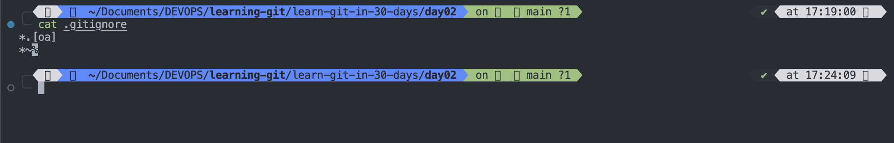
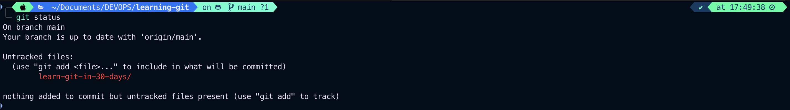
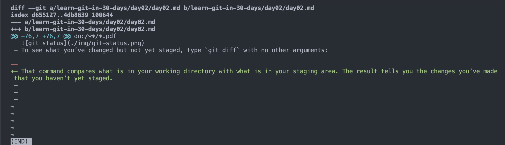
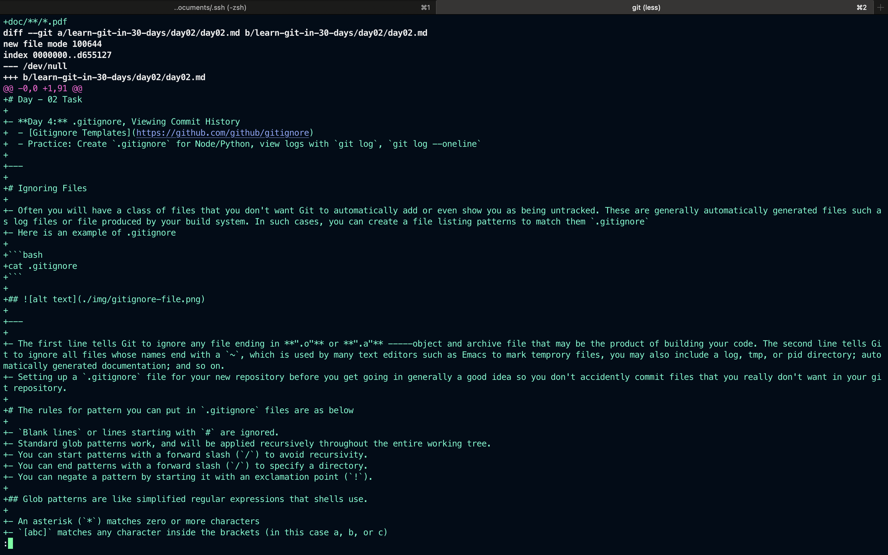
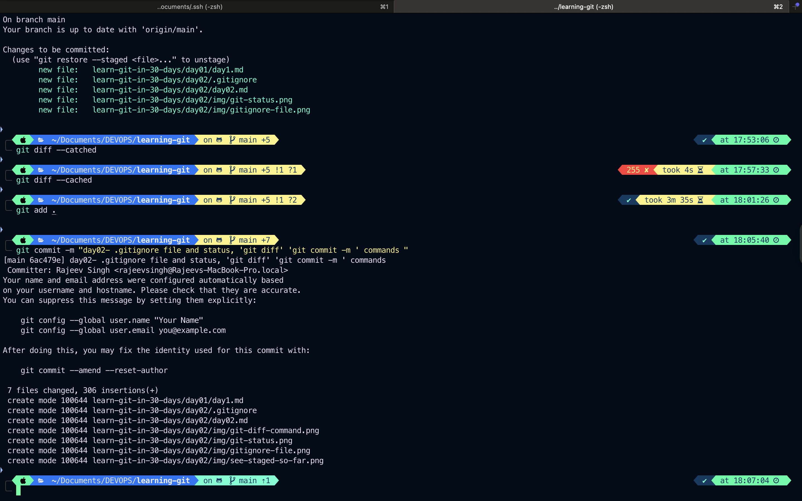
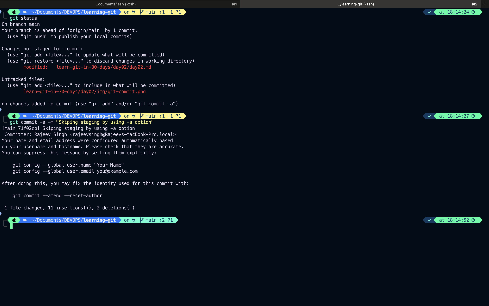

# Day - 02 Task

- **Day 4:** .gitignore, Viewing Commit History
  - [Gitignore Templates](https://github.com/github/gitignore)
  - Practice: Create `.gitignore` for Node/Python, view logs with `git log`, `git log --oneline`

---

# Ignoring Files

- Often you will have a class of files that you don't want Git to automatically add or even show you as being untracked. These are generally automatically generated files such as log files or file produced by your build system. In such cases, you can create a file listing patterns to match them `.gitignore`
- Here is an example of .gitignore

```bash
cat .gitignore
```

## 

---

- The first line tells Git to ignore any file ending in **".o"** or **".a"** -----object and archive file that may be the product of building your code. The second line tells Git to ignore all files whose names end with a `~`, which is used by many text editors such as Emacs to mark temprory files, you may also include a log, tmp, or pid directory; automatically generated documentation; and so on.
- Setting up a `.gitignore` file for your new repository before you get going in generally a good idea so you don't accidently commit files that you really don't want in your git repository.

# The rules for pattern you can put in `.gitignore` files are as below

- `Blank lines` or lines starting with `#` are ignored.
- Standard glob patterns work, and will be applied recursively throughout the entire working tree.
- You can start patterns with a forward slash (`/`) to avoid recursivity.
- You can end patterns with a forward slash (`/`) to specify a directory.
- You can negate a pattern by starting it with an exclamation point (`!`).

## Glob patterns are like simplified regular expressions that shells use.

- An asterisk (`*`) matches zero or more characters
- `[abc]` matches any character inside the brackets (in this case a, b, or c)
- a question mark (`?`) matches a single character
- brackets enclosing characters separated by a hyphen (`[0-9]`) matches any character between them (in this case 0 through 9)
- You can also use two asterisks to match nested directories; `a/**/z` would match a/z, a/b/z, a/b/c/z, and so on.
- Here is another example `.gitignore` file:

```bash
# ignore all .a files
*.a

# but do track lib.a, even though you're ignoring .a files above
!lib.a

# only ignore the TODO file in the current directory, not subdir/TODO
/TODO

# ignore all files in any directory named build
build/

# ignore doc/notes.txt, but not doc/server/arch.txt
doc/*.txt

# ignore all .pdf files in the doc/ directory and any of its subdirectories
doc/**/*.pdf

```

---

> `Tip`: GitHub maintains a fairly comprehensive list of good .gitignore file examples for dozens of projects and languages at https://github.com/github/gitignore if you want a starting point for your project.

> `Note`:
> In the simple case, a repository might have a single .gitignore file in its root directory, which applies recursively to the entire repository. However, it is also possible to have additional .gitignore files in subdirectories. The rules in these nested .gitignore files apply only to the files under the directory where they are located. The Linux kernel source repository has 206 .gitignore files.

---

# Viewing Your Staged and Unstaged Changes

- If the `git status` command is too vague for you — you want to know exactly what you changed, not just which files were changed — you can use the `git diff` command. We’ll cover `git diff` in more detail later, but you’ll probably use it most often to answer these two questions: What have you changed but not yet staged? And what have you staged that you are about to commit? Although git status answers those questions very generally by listing the file names, `git diff` shows you the exact lines added and removed — the patch, as it were.
- Let’s say you edit and `stage` the README file again and then edit the CONTRIBUTING.md file without staging it. If you run your `git status` command, you once again see something like this:
  
- To see what you’ve changed but not yet staged, type `git diff` with no other arguments:
  
- That command compares what is in your working directory with what is in your staging area. The result tells you the changes you’ve made that you haven’t yet staged.

> `Note`: It’s important to note that git diff by itself doesn’t show all changes made since your last commit — only changes that are still unstaged. If you’ve staged all of your changes, git diff will give you no output.

---

- git diff --cached to see what you’ve staged so far (--staged and --cached are synonyms):

```bash
git diff --cached
```

## 

---

> `Note`: **Git Diff in an External Tool**.

## We will continue to use the git diff command in various ways throughout the rest of the book. There is another way to look at these diffs if you prefer a graphical or external diff viewing program instead. If you run git difftool instead of git diff, you can view any of these diffs in software like emerge, vimdiff and many more (including commercial products). Run git difftool --tool-help to see what is available on your system.

- You can see that the default commit message contains the latest output of the `git status `command commented out and one empty line on top. You can remove these comments and type your commit message, or you can leave them there to help you remember what you’re committing.
  > `Note`: For an even more explicit reminder of what you’ve modified, you can pass the `-v` option to git commit. Doing so also puts the diff of your change in the editor so you can see exactly what changes you’re committing.

## 

- Now you’ve created your first commit! You can see that the commit has given you some output about itself: which branch you committed to (master), what SHA-1 checksum the commit has (6ac479e), how many files were changed, and statistics about lines added and removed in the commit.
- Remember that the commit records the snapshot you set up in your staging area. Anything you didn’t stage is still sitting there modified; you can do another commit to add it to your history. Every time you perform a commit, you’re recording a snapshot of your project that you can revert to or compare to later.

---

## Skipping the Staging Area

- Although it can be amazingly useful for crafting commits exactly how you want them, the staging area is sometimes a bit more complex than you need in your workflow. If you want to skip the staging area, Git provides a simple shortcut. Adding the `-a` option to the `git commit` command makes Git automatically stage every file that is already tracked before doing the commit, letting you skip the `git add` part:
  
- Notice how you don’t have to run git add on the README.md file in this case before you commit. That’s because the `-a` flag includes all changed files. This is convenient, but be careful; sometimes this flag will cause you to include unwanted changes.
-
-
-
-
-
