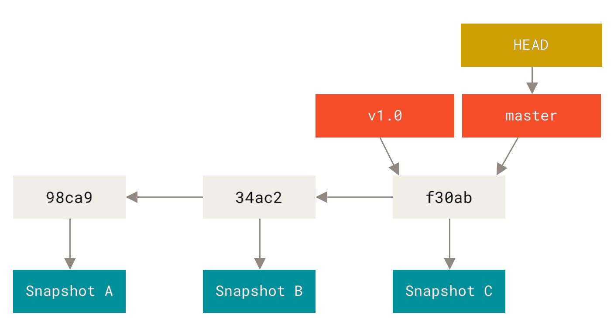

# Day-03: Tasks

**Day 5:** Branching Basics (create, rename, delete, checkout, merge)

- [Git Branching](https://git-scm.com/book/en/v2/Git-Branching-Branches-in-a-Nutshell)
- Practice: Create feature branches, merge back, handle basic conflicts.

---

# Git Branching

- Nearly every VCS(Version Control System) has some form of branching support. Branching means you diverge from the main line of development and continue to do work without messing with that main line. In many VCS tools, this is a somewhat expensive process, often requiring you to create a new copy of your source code directory, which can take a long time for large projects.
- Some people refer to Git’s branching model as its “killer feature,” and it certainly sets Git apart in the VCS community. Why is it so special? The way Git branches is incredibly lightweight, making branching operations nearly instantaneous, and switching back and forth between branches generally just as fast. Unlike many other VCSs, Git encourages workflows that branch and merge often, even multiple times in a day. Understanding and mastering this feature gives you a powerful and unique tool and can entirely change the way that you develop.

## Branches in a Nutshell

- To really understand the way Git does branching, we need to take a step back and examine how Git stores its data.
- As you may remember from **_What is Git?_**, Git doesn’t store data as a series of changesets or differences, but instead as a series of `snapshots`.
- When you make a commit, Git stores a commit object that contains a pointer to the snapshot of the content you staged. This object also contains the author’s name and email address, the message that you typed, and pointers to the commit or commits that directly came before this commit (its parent or parents): zero parents for the initial commit, one parent for a normal commit, and multiple parents for a commit that results from a merge of two or more branches.
- To visualize this, let’s assume that you have a directory containing three files, and you stage them all and commit. Staging the files computes a checksum for each one (the SHA-1 hash we mentioned in What is Git?), stores that version of the file in the Git repository (Git refers to them as blobs), and adds that checksum to the staging area:
- When you create the commit by running git commit, Git checksums each subdirectory (in this case, just the root project directory) and stores them as a tree object in the Git repository. Git then creates a commit object that has the metadata and a pointer to the root project tree so it can re-create that snapshot when needed.
- Your Git repository now contains five objects: three blobs (each representing the contents of one of the three files), one tree that lists the contents of the directory and specifies which file names are stored as which blobs, and one commit with the pointer to that root tree and all the commit metadata.
  
- If you make some changes and commit again, the next commit stores a pointer to the commit that came immediately before it.
  
- A branch in Git is simply a lightweight movable pointer to one of these commits. The default branch name in Git is `master`. As you start making commits, you’re given a `master` branch that points to the last commit you made. Every time you commit, the `master` branch pointer moves forward automatically.
  > `Note`: The “master” branch in Git is not a special branch. It is exactly like any other branch. The only reason nearly every repository has one is that the `git init `command creates it by default and most people don’t bother to change it.



---

# Creating a New Branch

What happens when you create a new branch? Well, doing so creates a new `pointer` for you to move around. Let’s say you want to create a new branch called `testing`. You do this with the `git branch` command:

```bash
git branch testing
```

This creates a new pointer to the same commit you’re currently on.

`Two branches pointing into the same series of commits`
`

---

- How does Git know what branch you’re currently on? It keeps a special pointer called `HEAD`. Note that this is a lot different than the concept of `HEAD` in other VCSs you may be used to, such as Subversion or CVS. In Git, this is a pointer to the local branch you’re currently on. In this case, you’re still on `master`.
  
  `HEAD pointing to a branch`
- You can easily see this by running a simple `git log` command that shows you where the branch pointers are pointing. This option is called `--decorate`.
  

---

# Switching Branches

To switch to an existing branch, you run the `git checkout `command. Let’s switch to the new testing branch:

```bash
git checkout testing
```


This moves `HEAD` to point to the **testing** branch.


## `HEAD points to the current branch`

- What is the significance of that? Well, let’s do another commit:

```bash
git commit -a -m "Git branching test using this commit from testing branch"
```


> `Note`: Commit id is different from actual so ignore it and focus on concept.

`The HEAD branch moves forward when a commit is made`

- This is interesting, because now your `testing` branch has moved forward, but your `master` branch still points to the commit you were on when you ran `git checkout` to switch branches. Let’s switch back to the `master` branch:

```bash
git checkout main
Switched to branch 'main'
Your branch is up to date with 'origin/main'.
```

> `Note`: git log doesn't show all the branches all the time.
> If you were to run `git log` right now, you might wonder where the "testing" branch you just created went, as it would not appear in the output.
> The branch hasn’t disappeared; Git just doesn’t know that you’re interested in that branch and it is trying to show you what it thinks you’re interested in. In other words, by default, `git log` will only show commit history below the branch you’ve checked out.
> To show commit history for the desired branch you have to explicitly specify it: `git log testing`. To show all of the branches, add `--all` to your `git log` command.
>  > `HEAD moves when you checkout`

---

- That command did two things. It moved the `HEAD` pointer back to point to the `main/master` branch, and it reverted the files in your working directory back to the snapshot that `main/master` points to. This also means the changes you make from this point forward will diverge from an older version of the project. It essentially rewinds the work you’ve done in your `testing` branch so you can go in a different direction.
  > `Note`: **Switching branches changes files in your working directory**
  > It’s important to note that when you switch branches in Git, files in your working directory will change. If you switch to an older branch, your working directory will be reverted to look like it did the last time you committed on that branch. If Git cannot do it cleanly, it will not let you switch at all.
  > Let's commit again because we already did some changes through main branch:

```bash
git commit -a -m "Switched back to main branch from testing and doing first commit after that."
```

Now your project history has diverged (see [`Divergent history`](https://git-scm.com/book/en/v2/ch00/divergent_history)). You created and switched to a branch, did some work on it, and then switched back to your main branch and did other work. Both of those changes are isolated in separate branches: you can switch back and forth between the branches and merge them together when you’re ready. And you did all that with simple `branch`, `checkout`, and `commit` commands.

`Divergent history`

---

- You can also see this easily with the `git log` command. If you run `git log --oneline --decorate --graph --all` it will print out the history of your commits, showing where your branch pointers are and how your history has diverged.
  

---

- Because a branch in Git is actually a simple file that contains the 40 character SHA-1 checksum of the commit it points to, branches are cheap to create and destroy. Creating a new branch is as quick and simple as writing 41 bytes to a file (40 characters and a newline).

- This is in sharp contrast to the way most older VCS tools branch, which involves copying all of the project’s files into a second directory. This can take several seconds or even minutes, depending on the size of the project, whereas in Git the process is always instantaneous. Also, because we’re recording the parents when we commit, finding a proper merge base for merging is automatically done for us and is generally very easy to do. These features help encourage developers to create and use branches often.

> `Note`: Creating a new branch and switching to it at the same time

> It’s typical to create a new branch and want to switch to that new branch at the same time — this can be done in one operation with git `checkout -b <newbranchname>`.

> `Note`: From Git version 2.23 onwards you can use git switch instead of git checkout to:

- Switch to an existing branch: `git switch testing-branch`.
- Create a new branch and switch to it: `git switch -c new-branch`. The `-c` flag stands for `create`, you can also use the full flag: `--create`.
- Return to your previously checked out branch: `git switch -`.

---

# Git Branching - Basic Branching and Merging

- continue tommorow from git branch merging
  https://git-scm.com/book/en/v2/Git-Branching-Basic-Branching-and-Merging
