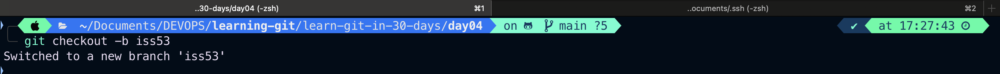
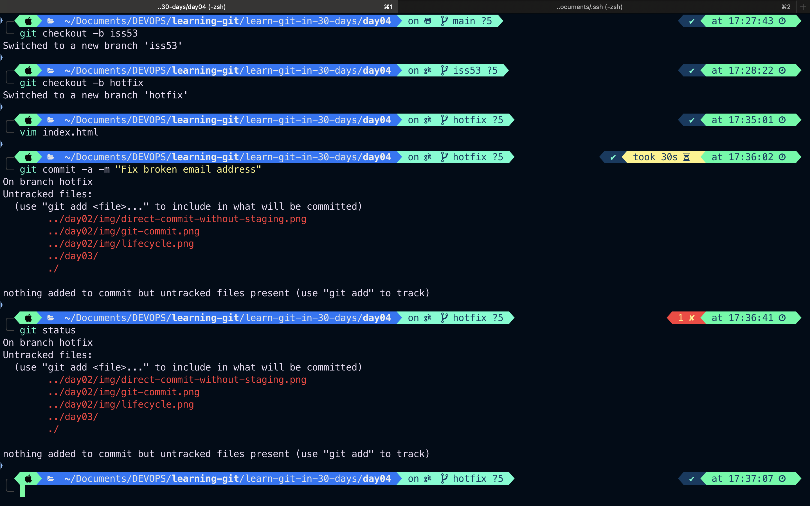

# Day-04: Tasks

## 1. Git Branching - Basic Branching and Merging

---

## Basic Branching and Merging

- Let’s go through a simple example of branching and merging with a workflow that you might use in the real world. You’ll follow these steps:
  - Do some work on a website
  - Create a branch for a new user story you are working on
  - Do some work in that branch
- At this stage, you’ll receive a call that another issue is critical and you need a hotfix. You’ll do the following:
  - Switch to your production branch.
  - Create a branch to add the hotfix.
  - After it’s tested, merge the hotfix branch, and push to production.
  - Switch back to your original user story and continue working.

### Basic Branching

- First, let’s say you’re working on your project and have a couple of commits already on the master branch.
  
  `A simple commit history`

---

- You’ve decided that you’re going to work on issue #53 in whatever issue-tracking system your company uses. To create a new branch and switch to it at the same time, you can run the `git checkout` command with the `-b` switch:
  

  ***

  
  `Creating a new branch pointer`

---

- The iss53 branch has moved forward with your work
- Now you get the call that there is an issue with the website, and you need to fix it immediately. With Git, you don’t have to deploy your fix along with the `iss53` changes you’ve made, and you don’t have to put a lot of effort into reverting those changes before you can work on applying your fix to what is in production. All you have to do is switch back to your `main` branch.

```bash
git checkout main
Switch to branch 'main'
```

- At this point, your project working directory is exactly the way it was before you started working on issue #53, and you can concentrate on your hotfix. This is an important point to remember: when you switch branches, Git resets your working directory to look like it did the last time you committed on that branch. It adds, removes, and modifies files automatically to make sure your working copy is what the branch looked like on your last commit to it.
- Next, you have a hotfix to make. Let’s create a `hotfix` branch on which to work until it’s completed:
  

`To delete branch `

```bash
git branch -d <branch-name>
```

---

# Start tomorrow from `Basic Merge Conflicts`

https://git-scm.com/book/en/v2/Git-Branching-Basic-Branching-and-Merging
