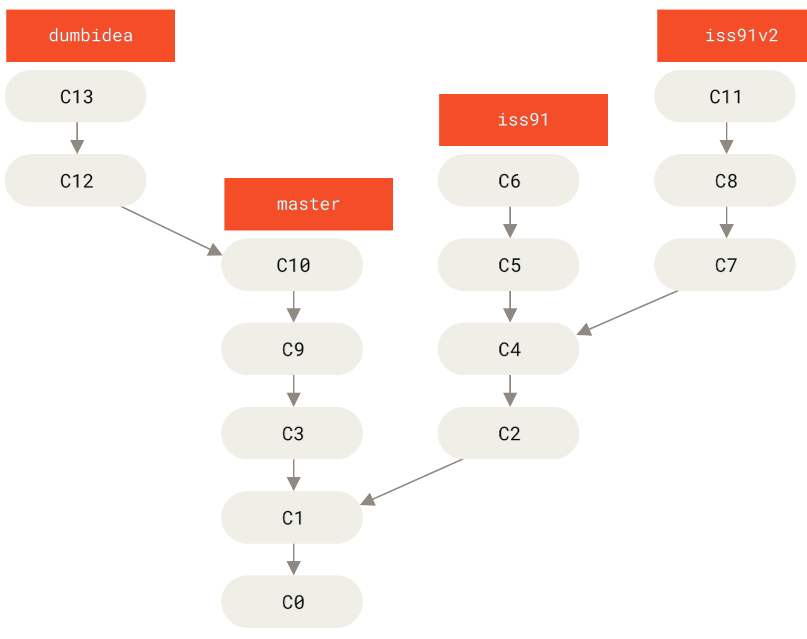

# Day-05: Tasks

1. Branching Workflow- done
2. Remote branches - https://git-scm.com/book/en/v2/Git-Branching-Remote-Branches
3. Basic Collaboration Concepts - pending

- Practice: Use a dummy project to simulate feature branch workflows.

---

## Git Branching Workflow

- Now that you have the basics of branching and merging down, what can should you do with them?
  In this section we will cover some common workflows that this lightwaight branching makes possible, so you can decide if you would like
  to incorporate into your own development cycle.

## Long-Running Branches

- Because Git uses a simple three-way merge, merging from one branch into another multiple times over a long period is generally easy to do.
  This means you can have several branches that are always open and that you use for different stages of your development cycle; you can merge regularly from some of them into others.
  
  `A linear view of progressive-stability branching`
  
  `A “silo” view of progressive-stability branching`

## Topic Branches

- Topic branches, however, are useful in projects of any size. A topic branch is a short-lived branch that you create and use for a single particular feature or related work. This is something you’ve likely never done with a VCS before because it’s generally too expensive to create and merge branches. But in Git it’s common to create, work on, merge, and delete branches several times a day.
- You saw this in the last section with the `iss53` and `hotfix` branches you created. You did a few commits on them and deleted them directly after merging them into your main branch. This technique allows you to context-switch quickly and completely — because your work is separated into silos where all the changes in that branch have to do with that topic, it’s easier to see what has happened during code review and such. You can keep the changes there for minutes, days, or months, and merge them in when they’re ready, regardless of the order in which they were created or worked on.
- Consider an example of doing some work (on master), branching off for an issue (iss91), working on it for a bit, branching off the second branch to try another way of handling the same thing (iss91v2), going back to your master branch and working there for a while, and then branching off there to do some work that you’re not sure is a good idea (dumbidea branch). Your commit history will look something like this:
  
  `Multiple topic branches`
- Now, let’s say you decide you like the second solution to your issue best (iss91v2); and you showed the dumbidea branch to your coworkers, and it turns out to be genius. You can throw away the original iss91 branch (losing commits C5 and C6) and merge in the other two. Your history then looks like this:
  
  `History after merging dumbidea and iss91v2`
- It’s important to remember when you’re doing all this that these branches are completely local. When you’re branching and merging, everything is being done only in your Git repository — there is no communication with the server.
