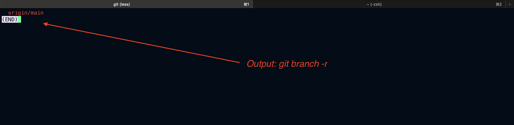

# Git Branching - Remote Branches

## What are Remote Branches?

Remote branches in Git are references (pointers) to the state of branches in your remote repositories. They are read-only and used to track changes made by collaborators.

Common remote: `origin`

Remote branches typically look like this:

```
origin/main
origin/dev
```

## Common Remote Branch Commands

### 1. Viewing Remote Branches

```bash
git branch -r
```



### 2. Fetching Remote Branch Updates

```bash
git fetch
```

`Output`:

```bash
git fetch
Enter passphrase for key '/Users/rajeevsingh/.ssh/id_ed25519':

```

### 3. Creating a Local Branch from a Remote Branch

```bash
git checkout -b dev origin/dev
```

### 4. Pushing a New Local Branch to Remote

```bash
git push origin new-feature
```

### 5. Deleting a Remote Branch

```bash
git push origin --delete old-feature
```

### 6. Tracking a Remote Branch

```bash
git branch --set-upstream-to=origin/dev dev
```

or directly when checking out:

```bash
git checkout --track origin/dev
```

## Example Workflow

### Scenario: You and your teammate are working on a project.

#### Step 1: Clone the Repository

```bash
git clone https://github.com/user/repo.git
cd repo
```

#### Step 2: Check Remote Branches

```bash
git branch -r
```

#### Step 3: Work on a New Branch

```bash
git checkout -b feature/login origin/main
# Make some changes
git add .
git commit -m "Add login feature"
git push origin feature/login
```

#### Step 4: Collaborator Pulls Your Branch

```bash
git fetch
git checkout feature/login
```

## Syncing Remote and Local

- To sync local tracking branch:

```bash
git pull
```

- To see differences between local and remote:

```bash
git fetch
git diff origin/dev
```

## Summary

| Command                                   | Description               |
| ----------------------------------------- | ------------------------- |
| `git branch -r`                           | List remote branches      |
| `git fetch`                               | Fetch updates from remote |
| `git checkout -b <local> origin/<remote>` | Create local from remote  |
| `git push origin <branch>`                | Push local to remote      |
| `git push origin --delete <branch>`       | Delete remote branch      |
| `git pull`                                | Pull changes from remote  |

---

**Note:** Remote branches are **read-only references**. To make changes, you must create a local branch.
