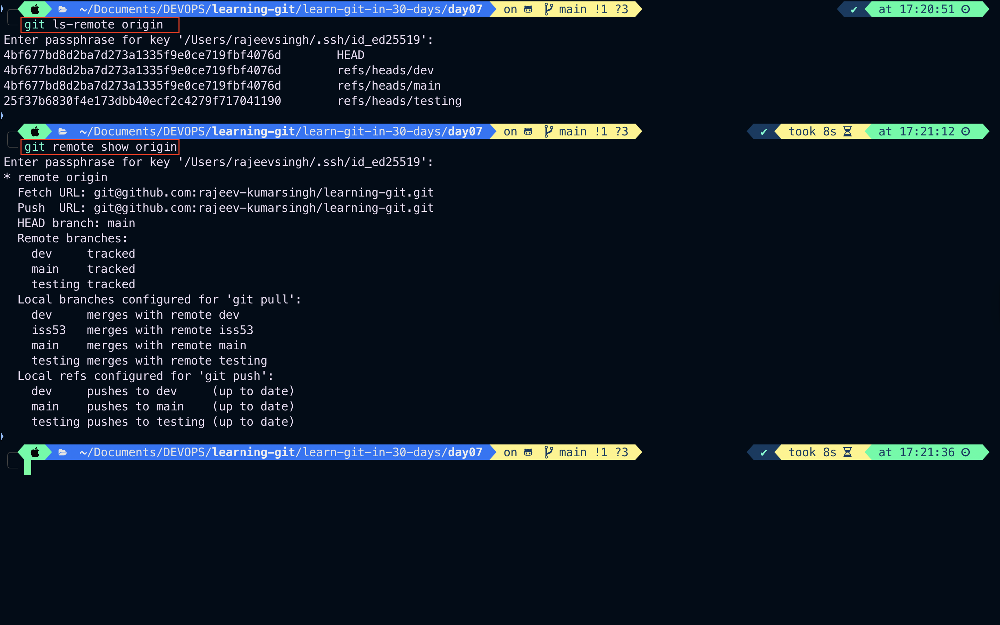

# Day-07:

1. Git Branching: Remote Branch

---

# Remote Branch

- Remote references are references (pointers) in your remote repositories, including branches, tags, and so on.
- You can get a full list of remote references explicitly with `git ls-remote <remote>`, or `git remote show <remote>` for remote branches as well as more information. Nevertheless, a more common way is to take advantage of remote-tracking branches.

```bash
git ls-remote origin
git remote show origin
```



---

- Remote-tracking branch names take the form `<remote>/<branch>`.
- Remote-tracking branch names take the form `<remote>/<branch>`. For instance, if you wanted to see what the master branch on your origin remote looked like as of the last time you communicated with it, you would check the `origin/master` branch. If you were working on an issue with a partner and they pushed up an `iss53` branch, you might have your own local `iss53` branch, but the branch on the server would be represented by the remote-tracking branch `origin/iss53`.
- This may be a bit confusing, so let’s look at an example. Let’s say you have a Git server on your network at `git.ourcompany.com`. If you clone from this, Git’s `clone` command automatically names it `origin` for you, pulls down all its data, creates a pointer to where its `master` branch is, and names it `origin/master` locally. Git also gives you your own local `master` branch starting at the same place as origin’s `master` branch, so you have something to work from.

> `Note`: “origin” is not special
> Just like the branch name “master” does not have any special meaning in Git, neither does “origin”. While “master” is the default name for a starting branch when you run `git init` which is the only reason it’s widely used, “origin” is the default name for a remote when you run `git clone`. If you run `git clone -o booyah` instead, then you will have `booyah/master` as your default remote branch.

-
