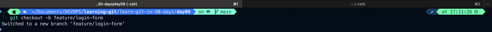
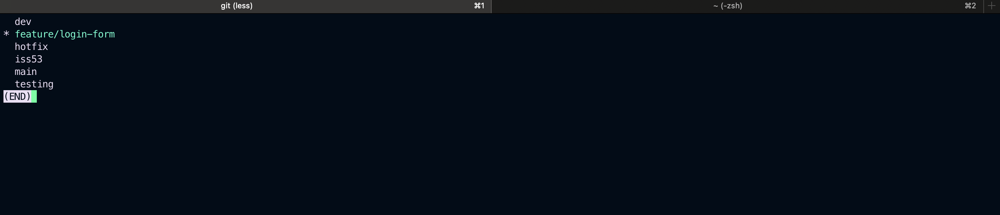

# 🌟 GitHub Pull Requests, Forks, and Labeling – Complete Guide

## 📌 What is a Pull Request (PR)?

A **Pull Request (PR)** is a request to merge changes from one branch (usually in a feature branch) into another (commonly the `main` or `develop` branch).

### ✅ Use Cases

- Collaborating in teams
- Reviewing code before merging
- CI/CD testing before integration

### 📄 Example

1. Developer creates a new branch: `feature/login-form`
2. Makes changes and commits
3. Pushes to remote: `git push origin feature/login-form`
4. Opens a PR to merge `feature/login-form` into `main`

```bash
# Example Git commands
git checkout -b feature/login-form
# Switched to a new branch 'feature/login-form'
# Verify branch
git branch
# make changes
git commit -am "Add login form"
git push origin feature/login-form
```




Then go to GitHub and click **"Compare & Pull Request"**.

---

## 🌍 What is a PR from a Fork?

A **fork** is a personal copy of someone else's repository.

When a contributor doesn’t have write access to the original repo, they:

1. Fork the repo to their account
2. Clone the forked repo locally
3. Create a new branch and make changes
4. Push changes to **their fork**
5. Open a PR **from their forked repo to the original repo**

### 📄 Example

```bash
# Fork a repo on GitHub
git clone https://github.com/your-username/repo-name.git
cd repo-name
git checkout -b fix-typo
# make changes
git commit -am "Fix typo in README"
git push origin fix-typo
```

Then go to the original repo and click **"New Pull Request"**, select your fork/branch as source.

---

## 🏷️ Labelling Issues and PRs

Labels in GitHub are colored tags used to categorize and prioritize **Issues** and **Pull Requests**.

### 🧾 Examples of Common Labels:

- `bug`
- `enhancement`
- `documentation`
- `good first issue`
- `needs review`
- `wontfix`

### 🛠️ How to Add a Label

1. Go to the issue or PR
2. Click on the **Labels** section on the right sidebar
3. Select one or more labels

### 🧪 Use Case in Open Source Projects

For example:

- `bug`: Something isn't working
- `good first issue`: Easy task for beginners
- `help wanted`: Maintainer wants external help
- `in progress`: Someone is actively working on it

---

## 🛠 PR Review Process

1. Contributor submits a PR
2. Reviewers are assigned
3. Reviewers provide feedback
4. Author makes changes
5. Once approved, the PR is merged

You can also use:

- **Reviewers**: Assign team members to review the PR
- **Assignees**: Indicate who is responsible
- **Projects/Milestones**: Attach PRs to sprints or releases

---

## ✅ Best Practices for PRs

- Keep PRs small and focused
- Use meaningful titles and descriptions
- Reference related issues (e.g., `Fixes #42`)
- Always review before merging
- Use CI/CD to test PRs automatically

---

## 📚 References

- [GitHub Pull Requests](https://docs.github.com/en/pull-requests)
- [Fork a Repo](https://docs.github.com/en/get-started/quickstart/fork-a-repo)
- [GitHub Label Management](https://docs.github.com/en/issues/using-labels-to-categorize-issues-and-pull-requests)
