# Git Merge Strategies & Conflict Resolution

## 1. Merge Strategies

### a. Fast-forward Merge

A fast-forward merge occurs when there is a direct path from the current branch (e.g., `main`) to the feature branch. In this case, Git simply moves the pointer forward.

#### Example:

```bash
# Create a new repo
git init merge-strategies
cd merge-strategies

# Create initial commit
echo "Line 1" > file.txt
git add file.txt
git commit -m "Initial commit"

# Create a new branch and add a commit
git checkout -b feature
echo "Line 2" >> file.txt
git commit -am "Add Line 2"

# Go back to main and merge (fast-forward)
git checkout main
git merge feature  # Fast-forward merge
```

### b. Non-Fast-forward (3-way) Merge

This occurs when both branches have new commits. Git will create a new merge commit.

#### Example:

```bash
# Start again from initial state
git checkout main
echo "Main line" >> file.txt
git commit -am "Main branch adds line"

git checkout -b feature
echo "Feature line" >> file.txt
git commit -am "Feature branch adds line"

# Now merge (non-fast-forward)
git checkout main
git merge feature  # Creates a merge commit
```

## 2. Creating and Resolving Merge Conflicts

Conflicts happen when changes are made to the same lines in different branches.

### Conflict Example:

```bash
# Initial setup
git init merge-conflict
cd merge-conflict

echo "Hello" > greet.txt
git add greet.txt
git commit -m "Initial commit"

# Create two branches
git checkout -b branchA
echo "Hello from A" > greet.txt
git commit -am "Edit from branch A"

git checkout main
git checkout -b branchB
echo "Hello from B" > greet.txt
git commit -am "Edit from branch B"

# Merge branchA into branchB (conflict!)
git checkout branchB
git merge branchA
```

### Resolving the Conflict:

Git will mark the conflict in the file:

```
<<<<<<< HEAD
Hello from B
=======
Hello from A
>>>>>>> branchA
```

Edit the file manually:

```
Hello from A and B
```

Then run:

```bash
git add greet.txt
git commit -m "Resolve merge conflict between A and B"
```

## 3. Merging Pull Requests (PRs)

In GitHub, Bitbucket, or GitLab, when merging PRs, you often choose:

- **Create a merge commit**: Keeps full history.
- **Squash and merge**: Combines all commits into one.
- **Rebase and merge**: Rewrites history for a linear structure.

Use according to your team’s policy.

---

**Practice Tip:** Try these examples in a local repo or use Git playgrounds like [https://learngitbranching.js.org](https://learngitbranching.js.org).

---

# Practice

1. To complete this level, do the following steps:

- Make a new branch called bugFix
- Checkout the bugFix branch with git checkout bugFix
- Commit once
- Go back to main with git checkout
- Commit another time
- Merge the branch bugFix into main with git merge
  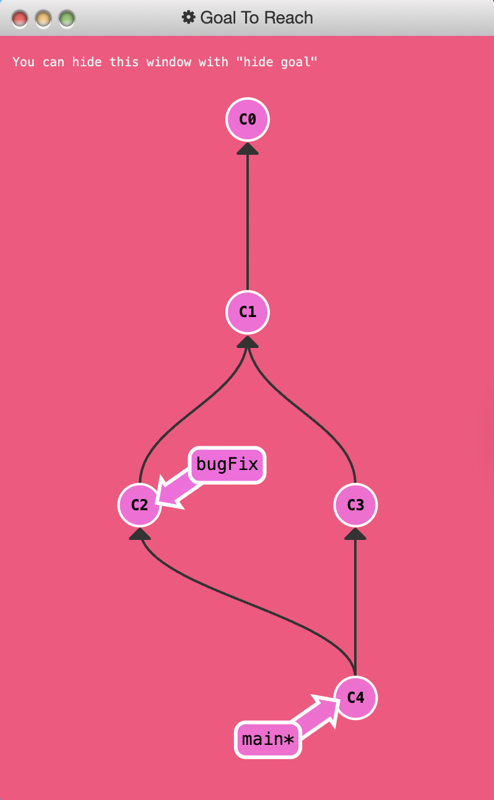

2. To complete this level, do the following

- Checkout a new branch named bugFix
- Commit once
- Go back to main and commit again
- Check out bugFix again and rebase onto main
  Good luck!
  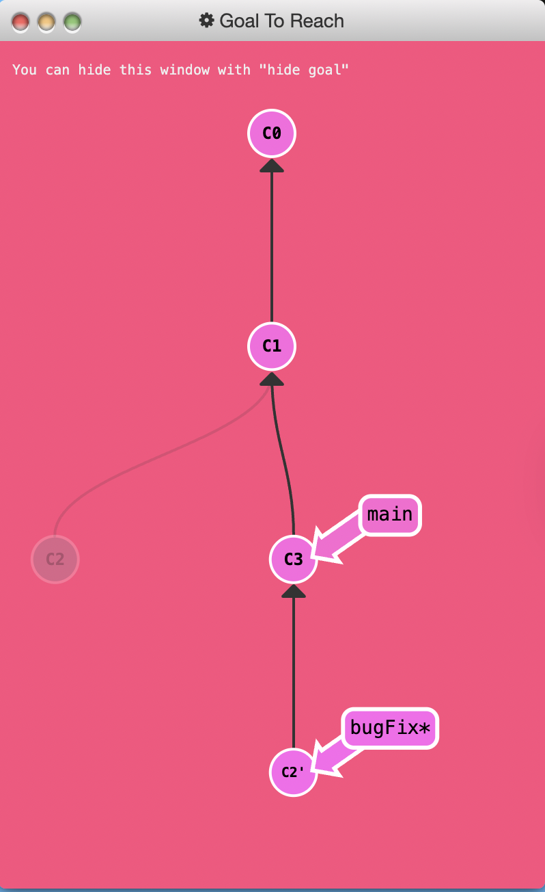
  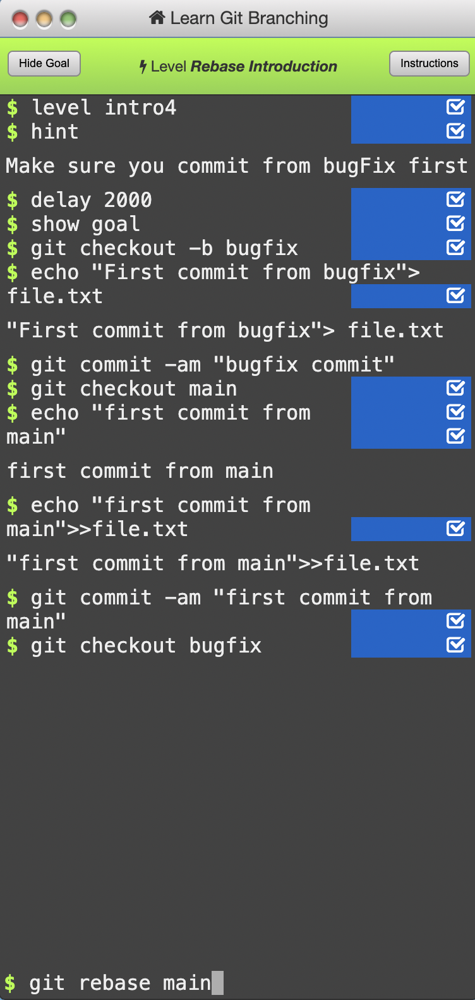

3. To complete this level, let's detach HEAD from bugFix and attach it to the commit instead.
   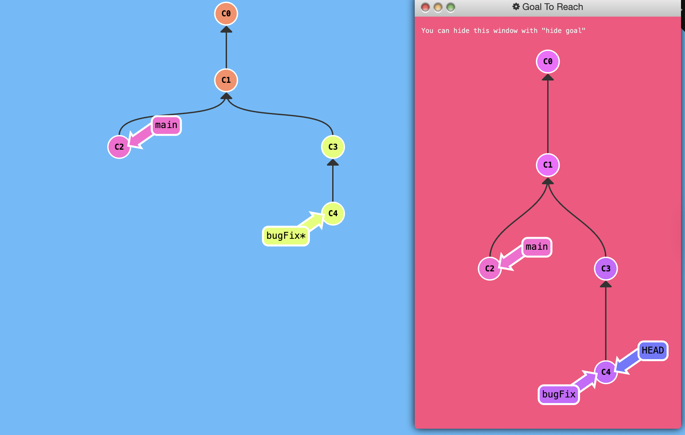
   > Solution: git checkout c4

# Relative Refs

- Moving around in Git by specifying commit hashes can get a bit tedious. In the real world you won't have a nice commit tree visualization next to your terminal, so you'll have to use `git log` to see hashes.
- Furthermore, hashes are usually a lot longer in the real Git world as well. For instance, the hash of the commit that introduced the previous level is fed2da64c0efc5293610bdd892f82a58e8cbc5d8. Doesn't exactly roll off the tongue...
- The upside is that Git is smart about hashes. It only requires you to specify enough characters of the hash until it uniquely identifies the commit. So I can type `fed2` instead of the long string above.
- Like I said, specifying commits by their hash isn't the most convenient thing ever, which is why Git has relative refs. They are awesome!
- With relative refs, you can start somewhere memorable (like the branch `bugFix` or `HEAD`) and work from there.
- Relative commits are powerful, but we will introduce two simple ones here:

  - Moving upwards one commit at a time with `^`

  - Moving upwards a number of times with `~<num>`

- Let's look at the Caret `(^)` operator first. Each time you append that to a ref name, you are telling Git to find the parent of the specified commit.
  - So saying `main^` is equivalent to "`the first parent of main`".
  - `main^^` is the grandparent (`second-generation ancestor`) of `main`

```bash
git checkout main^
```

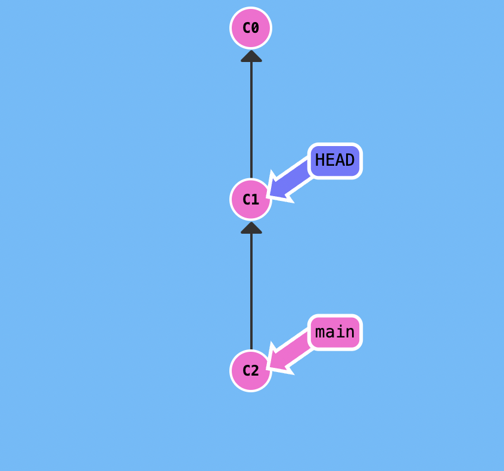

- You can also reference HEAD as a relative ref. Let's use that a couple of times to move upwards in the commit tree.

```bash
git checkout c3; git checkout HEAD^; git checkout HEAD^; git checkout HEAD^
```

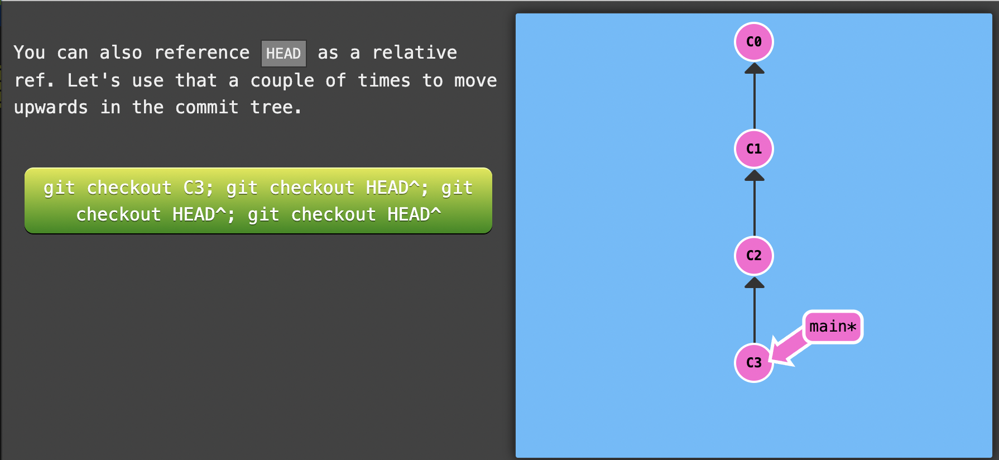
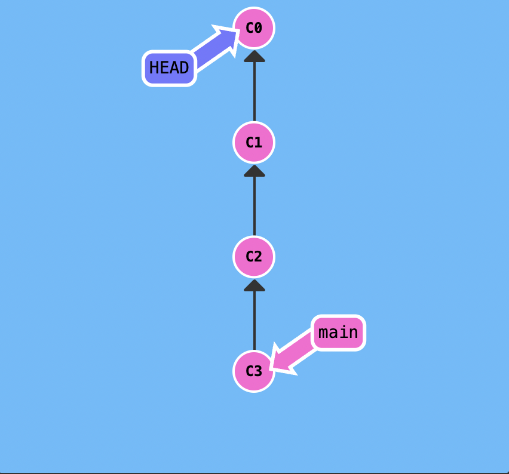

4. To complete this level, check out the parent commit of `bugFix`. This will detach `HEAD`.
   You can specify the hash if you want, but try using relative refs instead!
   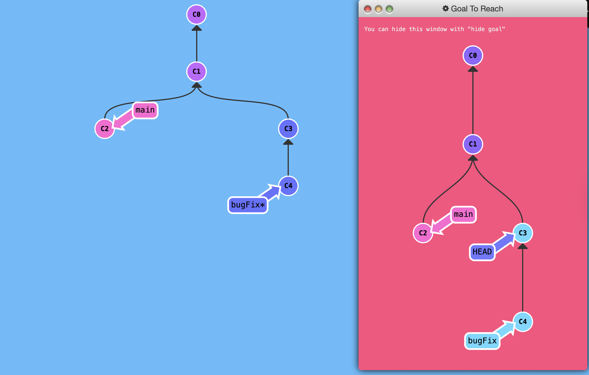
   > Solution: git checkout c4; git checkout HEAD^

---

# The "~" operator

- Say you want to move a lot of levels up in the commit tree. It might be tedious to type `^` several times, so Git also has the tilde (`~`) operator.
- The tilde operator (optionally) takes in a trailing number that specifies the number of parents you would like to ascend. Let's see in action:
  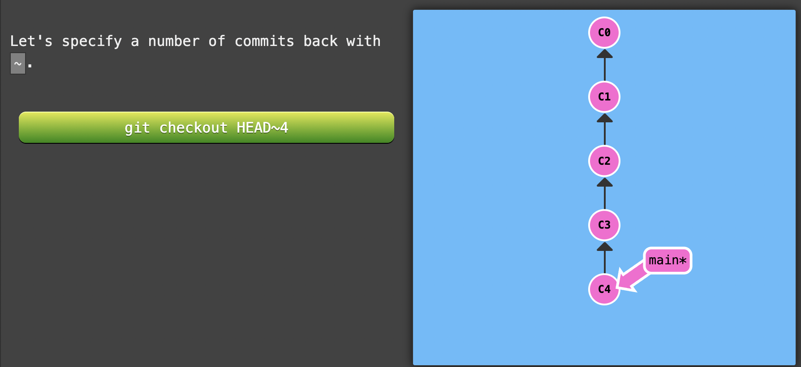

```bash
git checkout HEAD~4
```

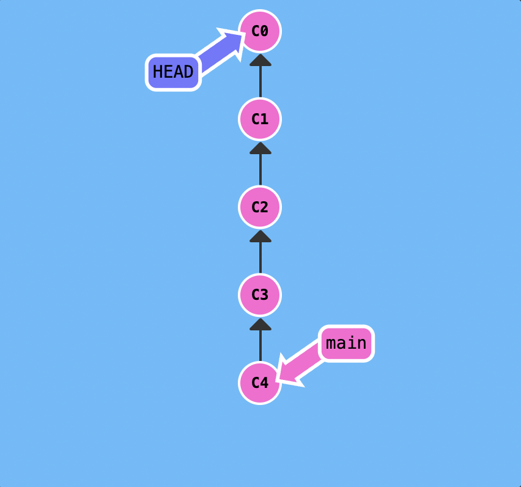

---

# Branch forcing

- You're an expert on relative refs now, so let's actually use them for something.

- One of the most common ways I use relative refs is to move branches around. You can directly reassign a branch to a commit with the -f option. So something like:

```bash
git branch -f main HEAD~3
```

moves (by force) the main branch to three parents behind HEAD.

> Note: In a real git environment `git branch -f` command is not allowed for your current branch.

- Let's see that previous command in action.
  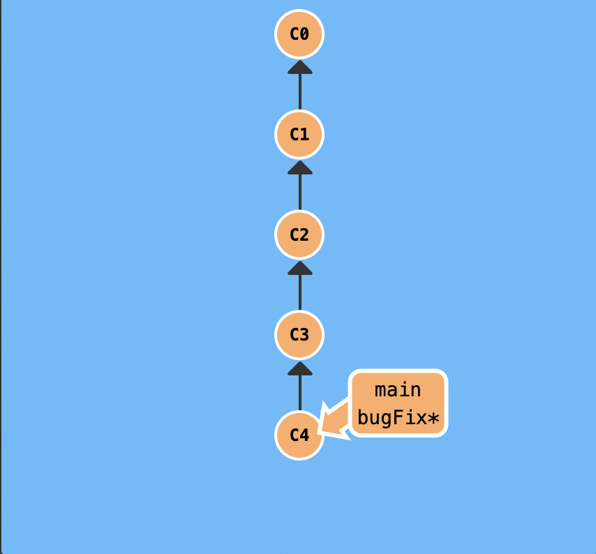

```bash
git branch -f main HEAD~3
```

There we go! Relative refs gave us a concise way to refer to C1 and branch forcing (-f) gave us a way to quickly move a branch to that location.
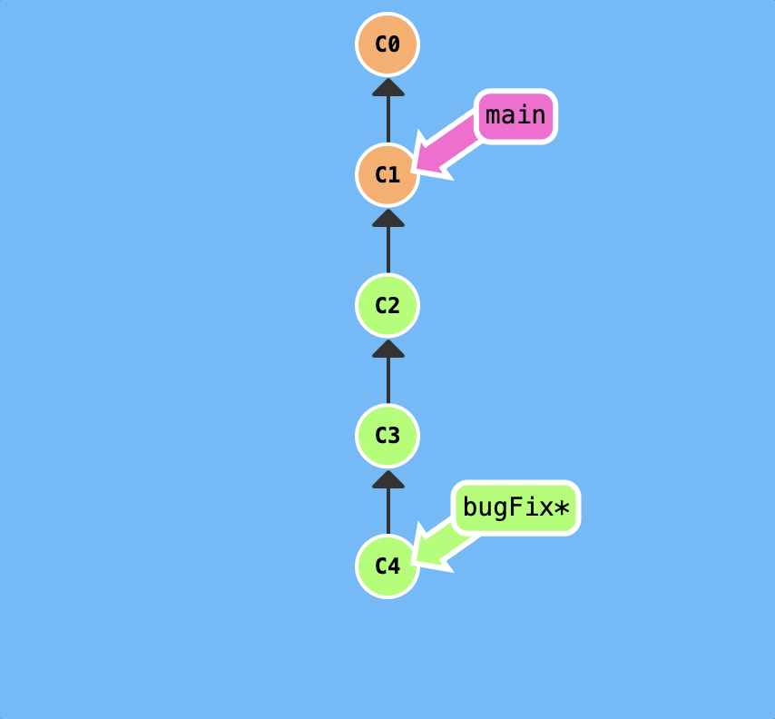

- Now that you have seen relative refs and branch forcing in combination, let's use them to solve the next level.

5. To complete this level, move `HEAD`, `main`, and `bugFix` to their goal destinations shown.
   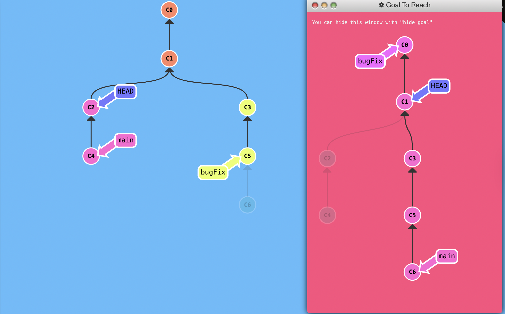

# Continue from the same

https://learngitbranching.js.org/
